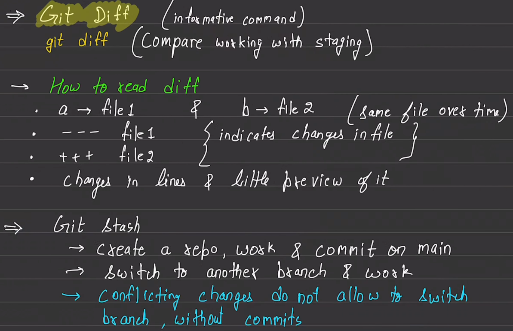
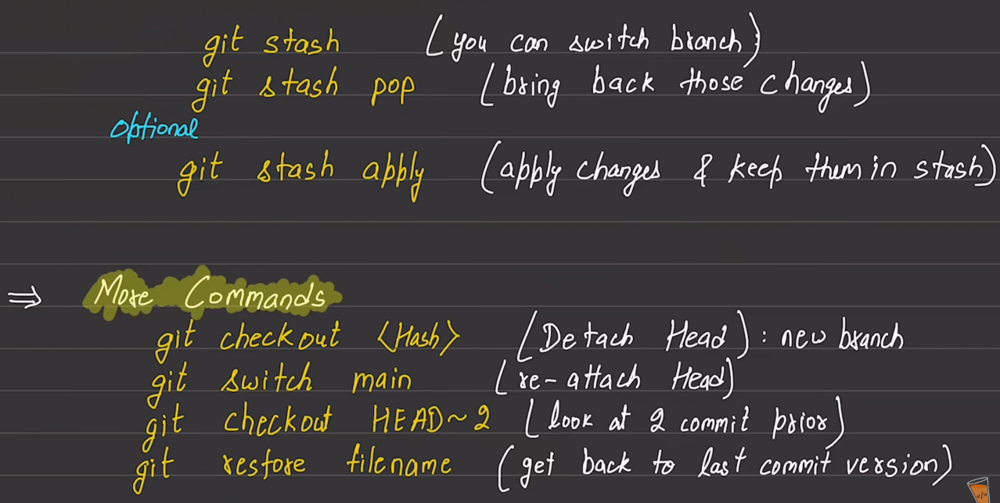
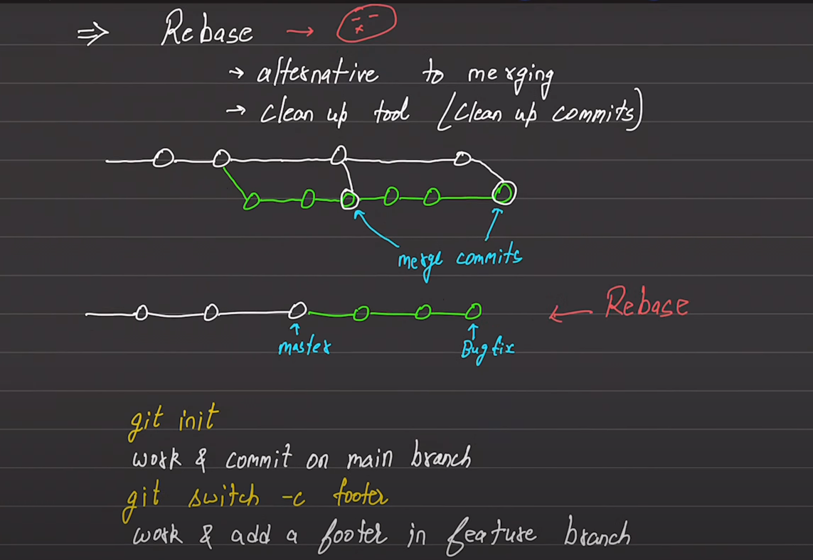
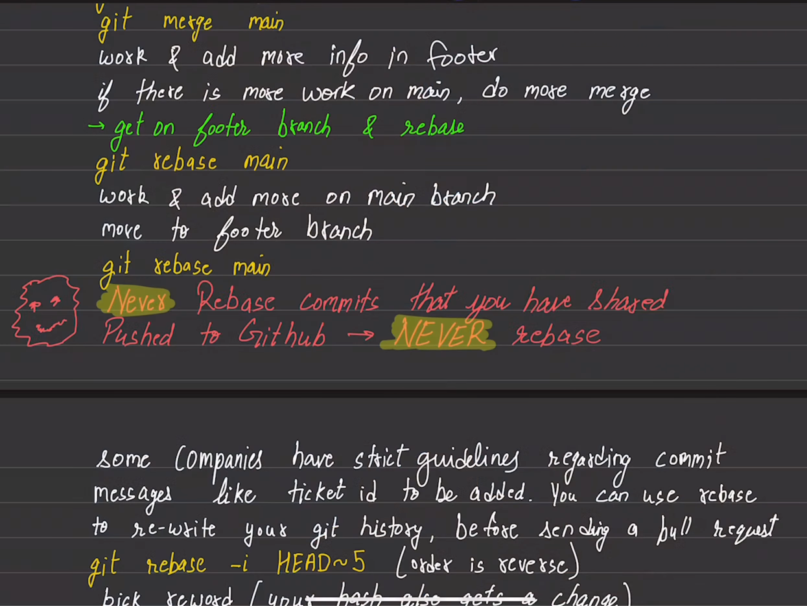

`Git` is a software and `GitHub` is a service.

# Git

    git --version
`git --version` is used to check the version of git.

    git status
`git status` is used to check the status of the git repository.

    ls -la
`ls -la` is used to show all hidden and shown files and folders in the repository.

    git init
`git init` is used to initialize the git repository. After this git starts tracking changes into the repository.

    git add <file name which we want to track>
`git add` is used to add files in the tracking zone (staging area) of the repository. Sometimes we use `git add .`.  `.` specifies to put all the changed files in the tracking zone.

    git commit -m "some commit message"
`git commit` is used to commit changes to the files which are in staging area. `-m` is tag to write some message why we commit changes.

    git log
`git log` is used to log all the commits and details.

    git log --oneline
`git log --oneline` is used to show the logs of commits int one line each commit.
    
    git config --global user.name "Lav Kumar yadav"
`git config --global user.name "Lav Kumar yadav"` is used set the username globally to the git system. whenenver we change in any repository this username will be shared.
    
    git config --global user.email "lavkumar3000@gmail.com"
`git config --global user.name "lavkumar3000@gmail"` is used set the email globally to the git system. whenenver we change in any repository this email will be shared.

    git config --global core.editor "code --wait"
`git config --global core.editor "code --wait"` is used to set the code editor for git as VsCode. It opnes the vscode and wait for to close the editor.

    cat .gitconfig
If we run this cmd from `home directory` it will open the .gitconfig file.

    git branch
`git branch` shows the all branches of the repository. and a pointer points to the current branch.

    git branch <new branch name which you want to craete>
`git  branch <branch name>` is used to create new branch.

    git checkout <branch name>
`git checkout <branch name>` is used to switch the branch.

    git switch <branch name>
`git branch <branch name>` is also used to switch the branch.

    git switch -c <branch name>
    git checkout -b <branch name>
`git switch -c <branch name>` or `git chechout -b <branch name>` is used to create a branch and move there.

    git merge <branch name>
`git merge <branch name>` is used to merge the the branch into current branch. Generally this cmd should be run from main or master branch.

    git branch -d <branch name>
`git branch -d <branch name>` is used to delete a branch. This cmd should be run very `carefully`. It may be `dangerous` to delete a branch.

    git diff --staged
`git diff --staged` is used to show the differences between last commit and the staged files.

    git diff <one commit id> <another commit id>
    git diff <one commit id>..<another commit id>
`git diff <one commit id> <another commit id>` or `git diff <one commit id>..<another commit id>` is used to show the differences between 2 commits.

    git diff <one branch name><another branch name>
    git diff <one branch name>..<another branch name>
`git diff <one branch name> <another branch name>` or `git diff <one branch name>..<another branch name>` is used to show the differences between 2 branches.

    git stash
`git stash` is a useful command in Git for temporarily saving your changes without committing them. it is used when you want to change the branch without committing the changes.

    git stash pop
`git stash pop` re-applies the most recent stash to your working directory and removes it from the stash list. If there are conflicts, Git will notify you, and you'll need to resolve them.

`Note`:- Stash is not limited to one branch. Stash can be moved from one branch to another.

    git stash list
`git stash list` is used to list the stashes in the current branch.

    git stash apply stashe@{1}
`git stash apply stashe@{1}` is used to apply the stash to the current branch. First we should `list` the stashes and apply the stash.

    git commit -am "it is used to adding and committing at the same time"
`-am` is meant to be adding and committing at the same time.

    git rebase master
`git rebase master` is used make the timeline same and rewrite the history and if we don't want unwanted commits of merging the branch. `never` run this cmd from master or main branch.