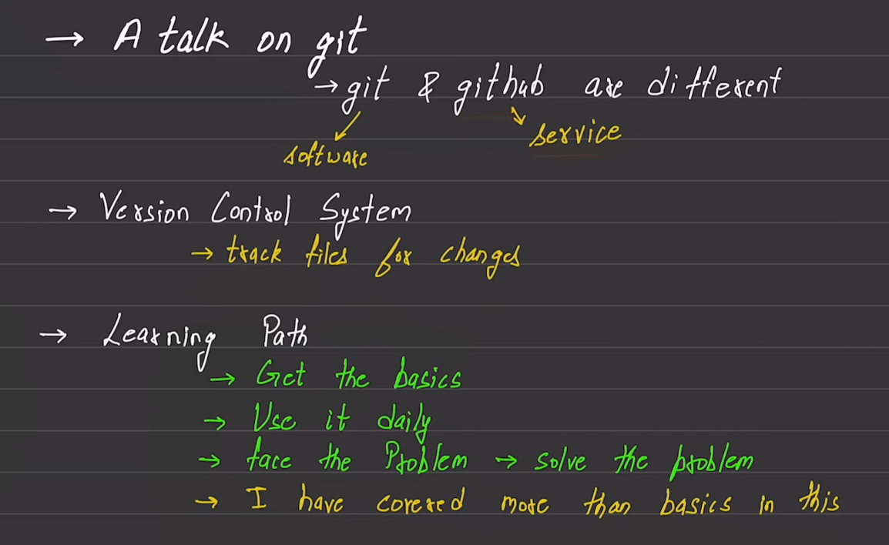
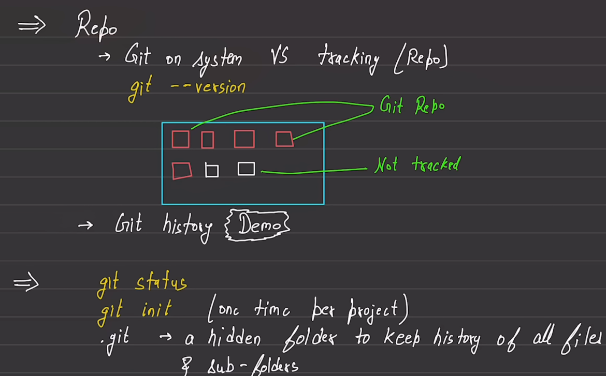
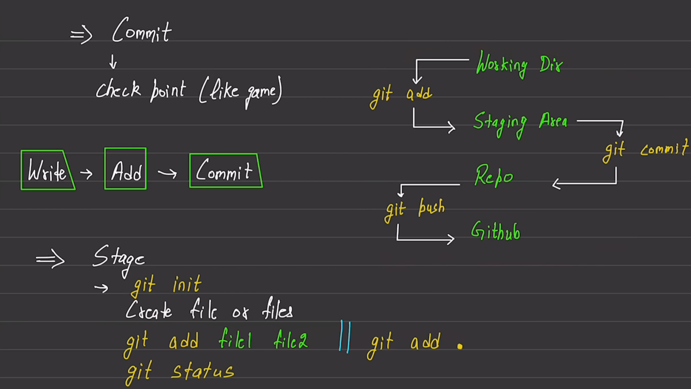
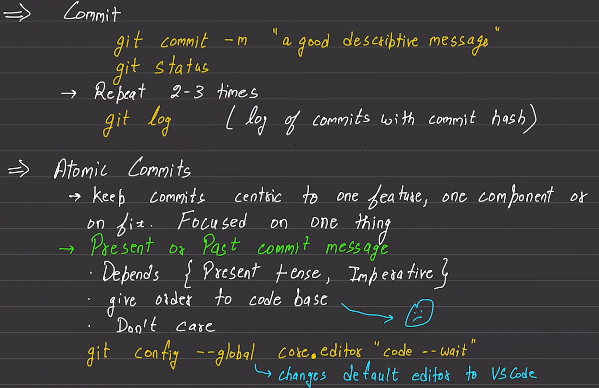
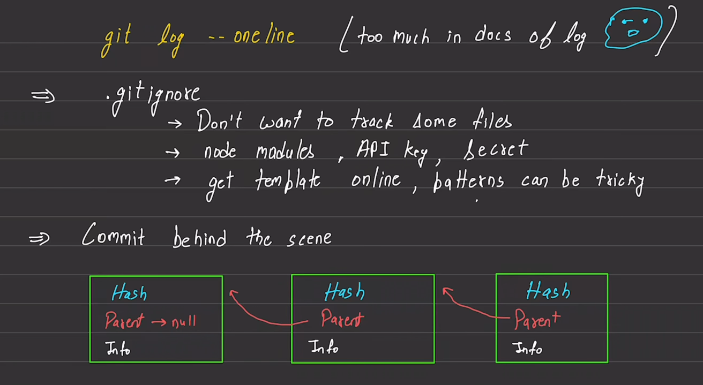
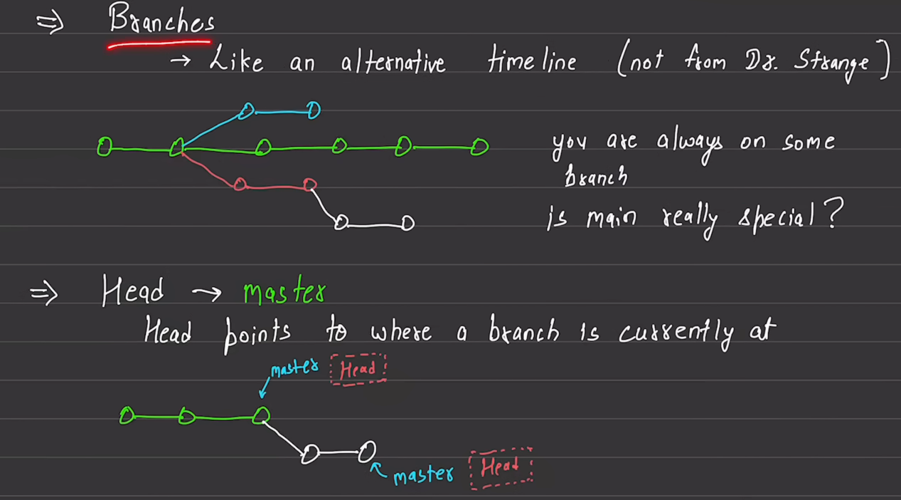
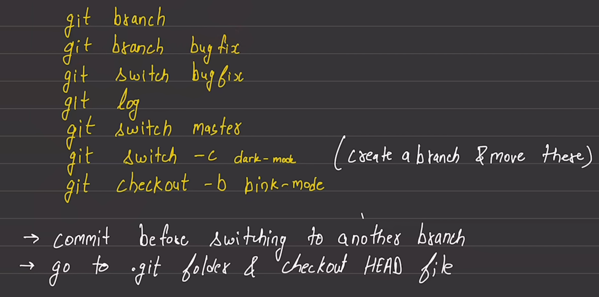
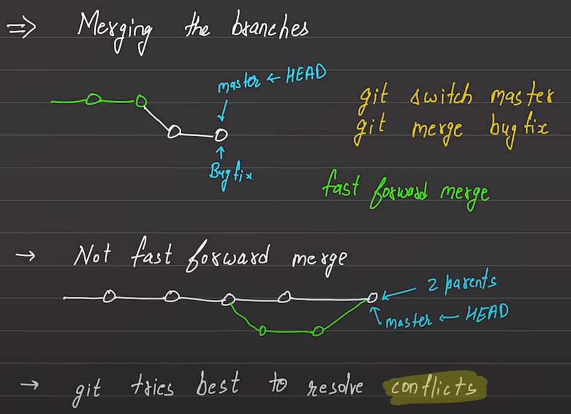
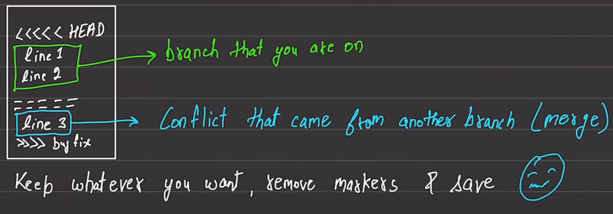

`Git` is a software and `GitHub` is a service.

# Git

    git --version
`git --version` is used to check the version of git.

    git status
`git status` is used to check the status of the git repository.

    ls -la
`ls -la` is used to show all hidden and shown files and folders in the repository.

    git init
`git init` is used to initialize the git repository. After this git starts tracking changes into the repository.

    git add <file name which we want to track>
`git add` is used to add files in the tracking zone (staging area) of the repository. Sometimes we use `git add .`.  `.` specifies to put all the changed files in the tracking zone.

    git commit -m "some commit message"
`git commit` is used to commit changes to the files which are in staging area. `-m` is tag to write some message why we commit changes.

    git log
`git log` is used to log all the commits and details.

    git log --oneline
`git log --oneline` is used to show the logs of commits int one line each commit.
    
    git config --global user.name "Lav Kumar yadav"
`git config --global user.name "Lav Kumar yadav"` is used set the username globally to the git system. whenenver we change in any repository this username will be shared.
    
    git config --global user.email "lavkumar3000@gmail.com"
`git config --global user.name "lavkumar3000@gmail"` is used set the email globally to the git system. whenenver we change in any repository this email will be shared.

    git config --global core.editor "code --wait"
`git config --global core.editor "code --wait"` is used to set the code editor for git as VsCode. It opnes the vscode and wait for to close the editor.

    cat .gitconfig
If we run this cmd from `home directory` it will open the .gitconfig file.

    git branch
`git branch` shows the all branches of the repository. and a pointer points to the current branch.

    git branch <new branch name which you want to craete>
`git  branch <branch name>` is used to create new branch.

    git checkout <branch name>
`git checkout <branch name>` is used to switch the branch.

    git switch <branch name>
`git branch <branch name>` is also used to switch the branch.

    git switch -c <branch name>
    git checkout -b <branch name>
`git switch -c <branch name>` or `git chechout -b <branch name>` is used to create a branch and move there.

    git merge <branch name>
`git merge <branch name>` is used to merge the the branch into current branch. Generally this cmd should be run from main or master branch.

    git branch -d <branch name>
`git branch -d <branch name>` is used to delete a branch. This cmd should be run very `carefully`. It may be `dangerous` to delete a branch.

